<h1 align="center">Smart Personal Finance Tracker</h1>
<h3 align="center">Personal Finance Management Web Application</h3>

---
## 📝 Smart Personal Finance Tracker


This is the final project for the Rapid Application Development module (ITS2020) at the Institute of Software Engineering (IJSE).

| Student Name | Buddhika Fernando |
| ------------ | ----------------- |
| Batch Number | GDSE 71 |

---
## 📋 Table of Contents

* [Project Overview](#project-overview)
* [Technologies & Tools Used](#technologies--tools-used)
* [Setup and Run Instructions](#setup-and-run-instructions)
  * [Prerequisites](#prerequisites)
  * [Frontend Setup](#frontend-setup)
  * [Backend Setup](#backend-setup)
* [Deployed URLs](#deployed-urls) 
* [Main Features](#main-features)
  * [User Features](#user-features)
  * [Admin Features](#admin-features)
* [Project Structure](#project-structure)
* [Screenshots](#screenshots)
* [Future Enhancements](#future-enhancements)
* [Contact](#contact)

---
## <a name="project-overview"></a>📖 Project Overview

Smart Personal Finance Tracker is a **web-based application** that helps users efficiently manage their personal finances, including income, expenses, and budgets.  

Key features include:

- Track income and expenses by category  
- Manage monthly budgets  
- Generate financial summaries and insights with **interactive analytics charts**  
- Secure authentication with email OTP  
- Admin dashboard for managing users, budgets, and transactions  
- **Smart receipt scanning with OCR** – automatically extract transaction details from uploaded receipts  
- **Advanced filtering** – view transactions by category, date, or type  
- **Export reports to PDF** – generate downloadable summaries for filtered data in analytics 

The app is **responsive**, **modern**, and designed for **both desktop and mobile** users, providing an intuitive interface for efficient financial management.

---
## <a name="technologies--tools-used"></a>🛠 Technologies & Tools Used

### Frontend
- React.js (TypeScript)  
- Tailwind CSS  
- Vite  
- React Router DOM  
- Axios  
- Lucide React Icons  
- SweetAlert2  

### Backend & Services
- Node.js & Express.js  
- MongoDB & Mongoose  
- JWT Authentication  
- bcrypt (password hashing)  
- Nodemailer (email OTP and notifications)  
- Tesseract.js (OCR for receipt scanning)  
- PDFKit (generate PDF reports from filtered data)  

### Tools
- Git & GitHub  
- VS Code  
- Postman  
- MongoDB Atlas  
- Vercel (frontend deployment)  

---
## <a name="setup-and-run-instructions"></a>⚙️ Setup and Run Instructions

### <a name="prerequisites"></a>📦 Prerequisites
- Node.js v18+  
- npm  
- MongoDB installed locally or MongoDB Atlas  
- A modern browser (Chrome, Firefox, Edge)

---

### <a name="frontend-setup"></a>🚀 Frontend Setup

- Clone the frontend repository
```
git clone https://github.com/your-username/smart-finance-tracker-frontend.git
cd smart-finance-tracker-frontend
```

- Install dependencies
 ```
npm install
```

- Start development server
```
npm run dev
```

Open the app in browser: http://localhost:5173

⚠️ Make sure to update API URLs in services/api.ts to point to your backend server.

---

### <a name="backend-setup"></a>🚀 Backend Setup

- Clone the backend repository (if separate)
```
git clone https://github.com/your-username/smart-finance-tracker-backend.git
cd smart-finance-tracker-backend
```

- Install dependencies
```
npm install
```

1. Configure environment variables in .env:

```

# MongoDB configuration
SERVER_PORT=5000
MONGO_URI=

# JWT secret key for authentication
JWT_SECRET=your_secret_key
JWT_REFRESH_SECRET=your_refresh_secret_key

# Cloudinary configuration (for image uploads)
CLOUDINARY_CLOUD_NAME=your_cloud_name
CLOUDINARY_API_KEY=your_api_key
CLOUDINARY_API_SECRET=your_api_secret

# Email credentials (for OTP & notifications)
SMTP_USER=your_email@example.com
SMTP_PASS=your_email_password
SMTP_HOST=smtp.gmail.com
SMTP_PORT=587
```

2. Run the backend server:
```
npm start
```

Backend will run on: http://localhost:5000

✅ The backend handles JWT authentication, transaction CRUD, OCR processing, PDF report generation, and email OTP functionality.

---

## <a name="deployed-urls"></a>🌍 Deployed URLs

- **Frontend:** [https://smart-finance-tracker-frontend.vercel.app](https://smart-personal-finance-tracker-be.vercel.app)  
- **Backend:** [https://smart-finance-tracker-backend.vercel.com](https://smart-personal-finance-tracker-be.vercel.app)

> 💡 You can access the fully deployed application from these URLs without running it locally.

---

## <a name="main-features"></a>✨ Main Features

### <a name="user-features"></a>👤 User Features
- Secure registration and login with JWT authentication  
- Add, edit, and delete income and expense transactions  
- Category-based financial tracking  
- Monthly budget management  
- **Smart receipt scanning with OCR** – automatically extract transaction details from uploaded receipts  
- **Advanced filtering** – view transactions by category, type, or date range  
- **Export reports to PDF** – download summaries of filtered data  
- Interactive analytics and charts for better insights  
- Responsive and modern dashboard UI  

### <a name="admin-features"></a>🛡 Admin Features
- Admin dashboard with system overview  
- View all users, budgets, and transactions  
- Manage expense and income categories  
- Approve, block, or manage users  
- Generate reports and insights for all users  
- Monitor user activity and financial trends

---
## <a name="project-structure"></a>🗂 Project Structure

This is the typical folder structure for the **Smart Personal Finance Tracker** project:


```text
src/
 ├── assets/
 │   └── default-user.jpg
 │
 ├── components/
 │   ├── AdminSidebar.tsx
 │   ├── Layout.tsx
 │   ├── Sidebar.tsx
 │   └── SidebarWrapper.tsx
 │
 ├── context/
 │   └── authContext.tsx
 │
 ├── pages/
 │   ├── Admin/
 │   │   ├── Analytics.tsx
 │   │   ├── Category.tsx
 │   │   ├── Help.tsx
 │   │   ├── Home.tsx
 │   │   ├── Settings.tsx
 │   │   ├── Transaction.tsx
 │   │   └── Users.tsx
 │   │
 │   ├── Auth/
 │   │   ├── ForgotPassword.tsx
 │   │   ├── Login.tsx
 │   │   └── Register.tsx
 │   │
 │   └── User/
 │   │   ├── AnalyticsPage.tsx
 │   │   ├── Budget.tsx
 │   │   ├── Categories.tsx
 │   │   ├── HelpPage.tsx
 │   │   ├── Home.tsx
 │   │   ├── SettingsPage.tsx
 │   │   └── Transactions.tsx
 │   │    
 │   │
 │   └── Welcome.tsx
 │ 
 ├── routes/
 │   └── index.tsx
 │
 ├── services/
 │   ├── analytics.ts
 │   ├── api.ts
 │   ├── auth.ts
 │   ├── budget.ts
 │   ├── category.ts
 │   ├── ocr.ts
 │   ├── transaction.ts
 │   └── user.ts
 │
 ├── App.css
 ├── App.tsx
 ├── index.css
 └── main.tsx
  ```

---
## <a name="screenshots"></a>📸 Screenshots

1. ### Welcome Page


2. ### Authentication
- **Login Page**  
  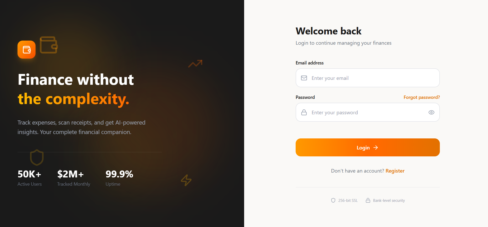  
- **Register Page**  
  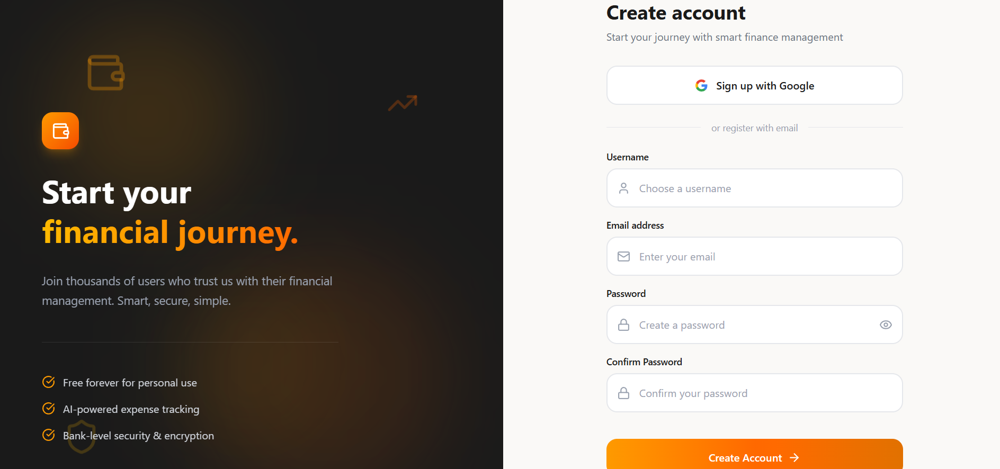  
- **Forgot Password Page**  
  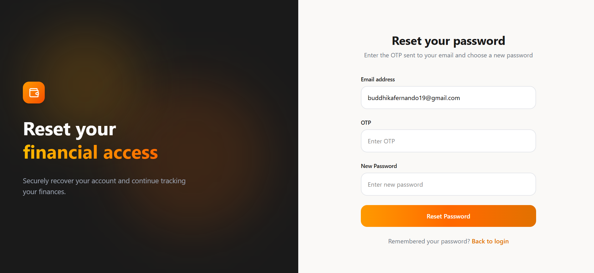

3. ### User Section
- **User Dashboard**  
  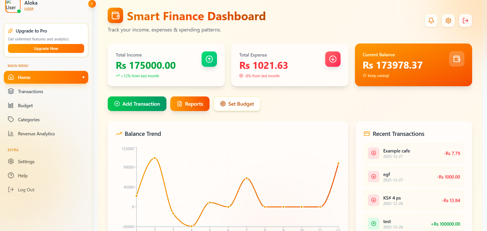
- **User Transactions**  
  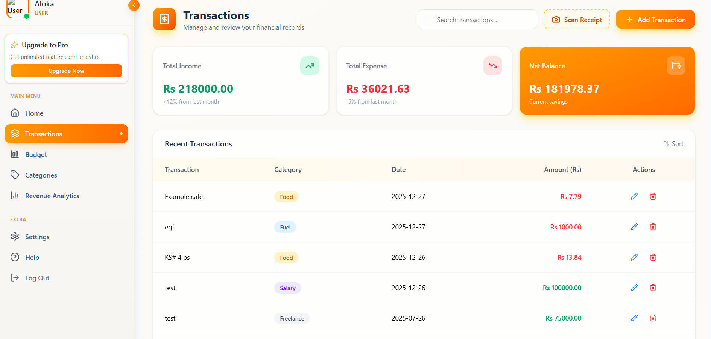
- **User Budget**  
  
- **User Categories**  
  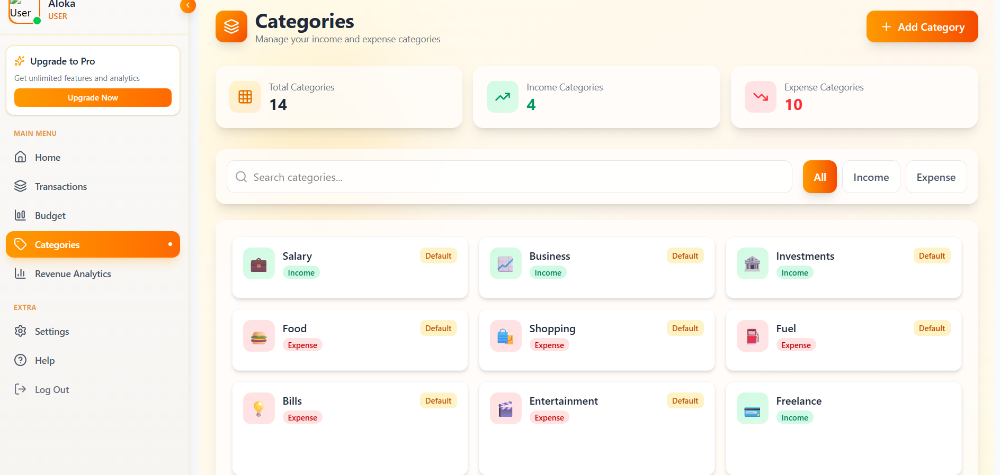     
- **User Analytics**  
  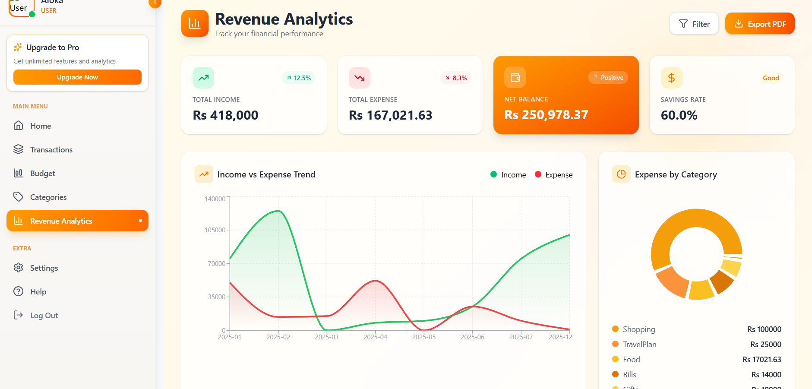  
- **User Settings**  
  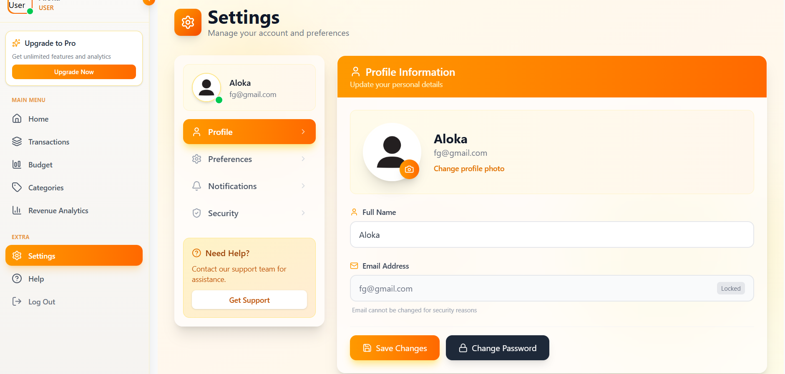   
- **User Help Page**  
  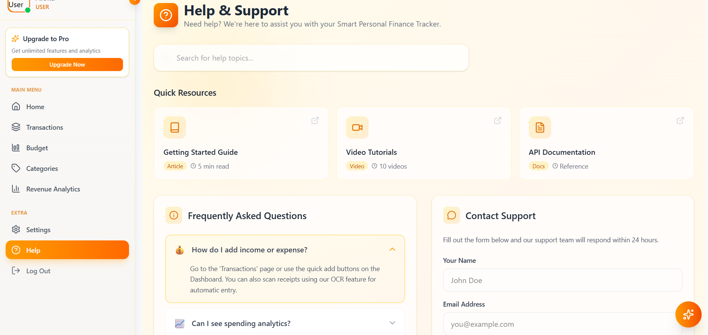  

4. ### Admin Section
- **Admin Dashboard**  
  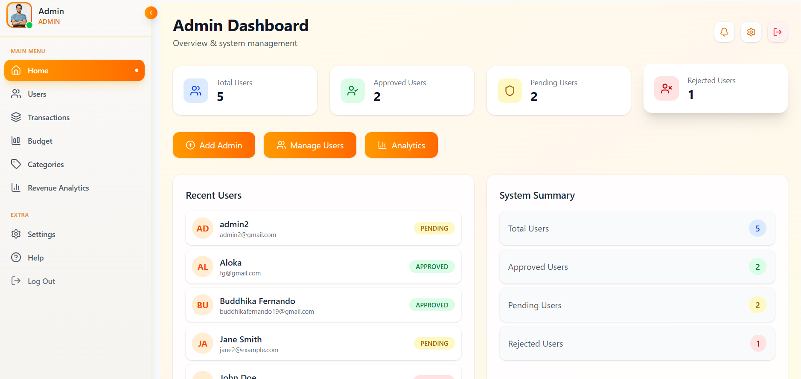
- **User Management**  
  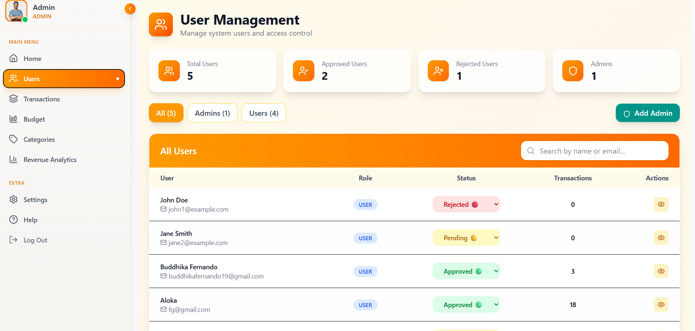   
- **Transactions Management**  
  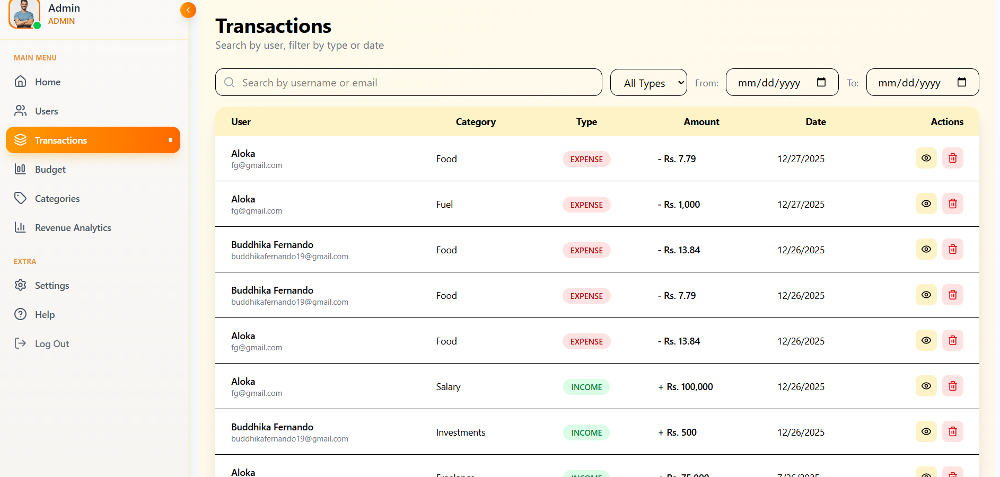
- **Budgets Management**  
    
- **Categories Management**  
  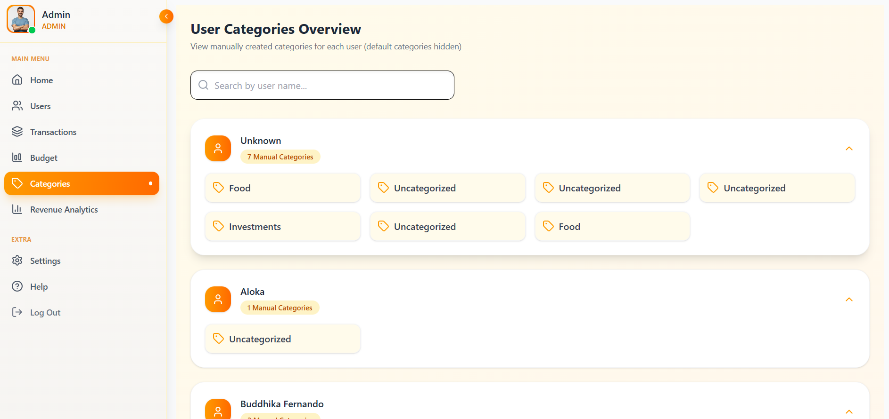   
- **Analytics Page**  
  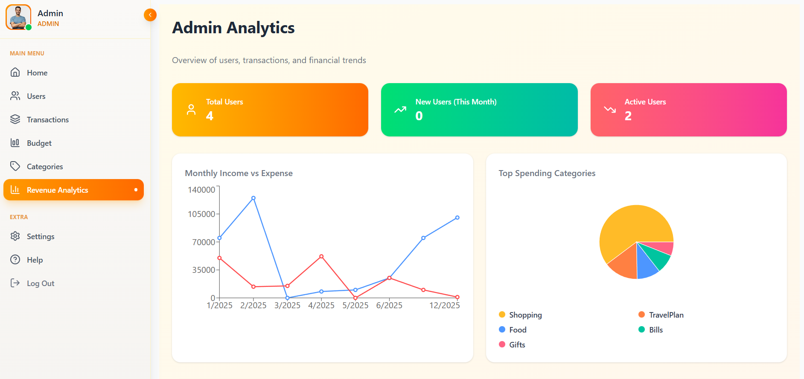  
  
5. ### OCR Features
- **OCR Scanning Page**  
  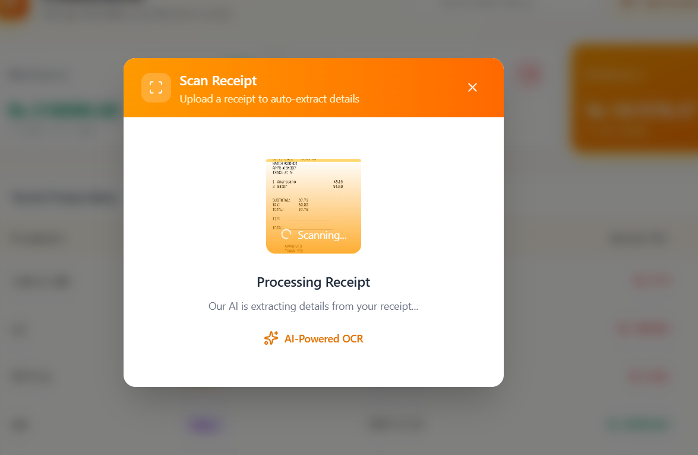  
- **OCR Details Page**  
  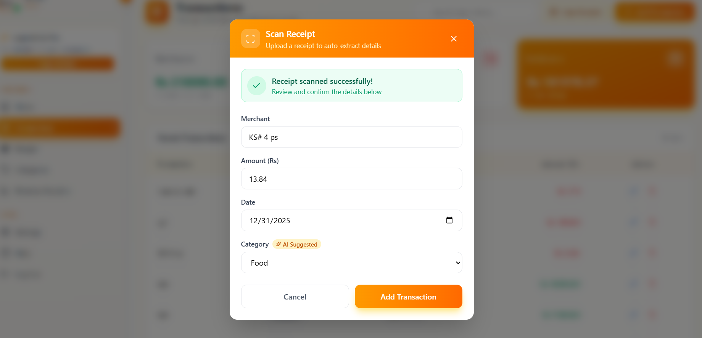

 
> 💡 Store all screenshots inside a `screenshots/` folder in the project root.

---
## <a name="future-enhancements"></a>🔮 Future Enhancements

Planned improvements for upcoming versions of **Smart Personal Finance Tracker**:

- 📱 **Mobile App (Android/iOS)** – Native or cross-platform app for on-the-go financial management  
- 🤖 **AI-Based Insights & Recommendations** – Suggest budgets, savings tips, and detect spending patterns  
- 🌍 **Multi-Language Support** – English, Sinhala, Tamil for a broader user base  
- 🔔 **Real-Time Notifications** – Instant alerts for transactions, budget limits, or OTP verification  
- 📊 **Advanced Analytics & Reports** – Visual insights and trends for both users and admins  
- 💳 **Premium Features / Subscription Plans** – Paid features for advanced reporting or additional users  

---
## <a name="contact"></a>📧 Contact

For any questions or support regarding the **Smart Personal Finance Tracker**, you can reach out to the author:

- **Name:** Buddhika Fernando  
- **Email:** [buddhika.fernando@example.com](mailto:buddhikafernando19@example.com)   
- **LinkedIn:** [Buddhika Fernando](https://www.linkedin.com/in/buddhika-fernando-73606131a/)


